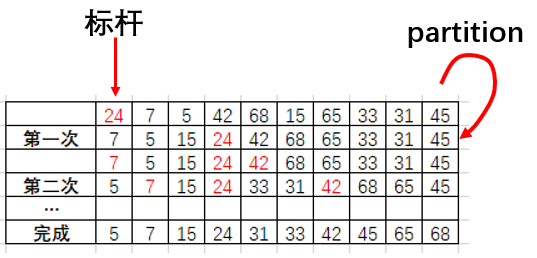
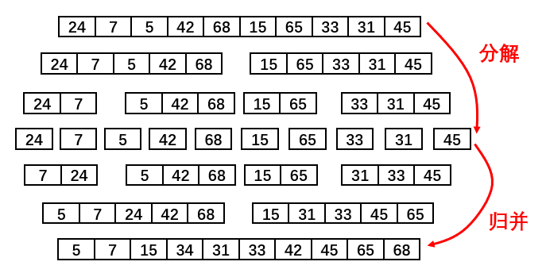

## 排序
  
排序是一种最基础的算法，以下六种排序算法认为数据可全部载入内存，也就是内部排序。  

### O(n2)排序
n2的排序算法理解相对简单，常见的三种n2的算法如下。  
  
***冒泡排序***  
两个for遍历整个数组，每遍历一次，就会加入一个新元素，把新元素从底部开始冒泡，排到合适的位置。  
```
void BubbleSort(vector<int> &data)
{
	for (unsigned int i = 1; i < data.size(); i++)
	{
		for (unsigned int j = i; j > 0; --j)
		{
			if (data[j - 1] < data[j])
			{
				swap(data[j - 1], data[j]);
			}
		}
	}
}
```

***插入排序***  
每次新加入一个数据，并且把加入的新数据插入到已排序的数组中的合适位置。  
```
void InsertSort(vector<int> &data)
{
	for (unsigned int i = 0; i < data.size(); ++i)
	{
		for (int j = i; j - 1 >= 0; --j)
		{
			if (data[j] > data[j - 1])
			{
				swap(data[j], data[j - 1]);
			}
			else
			{
				continue;
			}
		}
	}
}
```

***选择排序***  
每次遍历整个数组，选择未排序部分中最小的元素，并放到未排序数据的头部。  
```
void ChoiceSort(vector<int> &data)
{
	for (unsigned int i = 0; i < data.size(); ++i)
	{
		int maxpos = i;
		for (unsigned int j = i; j < data.size(); ++j)
		{
			if (data[j] > data[maxpos])
			{
				maxpos = j;
			}
		}
		swap(data[maxpos], data[i]);
	}
}
```


### 快速排序
快排基于分治思想，使用一个所谓的partition函数，将一个大问题分解为小问题。  
即partition函数会选择一个标杆，把大于标杆的元素移动到标杆右边，小于标杆的元素移动到标杆左边，则把一个大排序问题分解成为了标杆两侧的小排序问题。  
***快排过程如下***  
  

```
int Partition(vector<int> &data, int start, int end)
{
	int flag = start;
	while (start < end)
	{
		//先走的一定是标杆的对段！！！记住
		while (start < end && data[end] < data[flag])
		{
			end--;
		}
		while (start < end && data[start] >= data[flag])
		{
			start++;
		}
		if (start < end)
		{
			swap(data[start], data[end]);
		}
	}
	swap(data[end], data[flag]);
	return start;
}

void DoQuickSort(vector<int> &data, int start, int end)
{
	if (start < end)
	{
		int flag = Partition(data, start, end);
		DoQuickSort(data, start, flag - 1);
		DoQuickSort(data, flag + 1, end);
	}
}
```

### 归并排序
归并排序基于分治的思想，把一个区间划分成为两个小区间，并且认为两个小区间都是已经排序完成，这样只需用把两个已经排序的小区间合并成为一个即可，而小区间的排序问题则是小规模问题。  
***归并排序过程如下***  
  

```
void DoMergeSort(vector<int> &data, vector<int> &helper, int start, int end)
{
	if (start < end)
	{
		int mid = (start + end) / 2;
		//归并分区间的技巧是一定要保证区间不能重复，不然可能陷入死递归调用
		DoMergeSort(data, helper, start, mid);
		DoMergeSort(data, helper, mid + 1, end);

		int i = start, j = mid + 1;
		int helppos = start;
		while (i <= mid && j <= end)
		{
			if (data[i] > data[j])
			{
				helper[helppos++] = data[i++];
			}
			else
			{
				helper[helppos++] = data[j++];
			}
		}

		while (i <= mid)
		{
			helper[helppos++] = data[i++];
		}
		while (j <= end)
		{
			helper[helppos++] = data[j++];
		}

		helppos = start;
		while (helppos <= end)
		{
			data[helppos] = helper[helppos];
			helppos++;
		}
	}
}
```

### 堆排序
堆排序基于堆的数据结构，建堆过程时间复杂度为O(n)，证明过程省略。而每一次堆调整复杂度为O(logn)，这样每一个元素调整一次，排序过程复杂度为O(nlogn)，堆排序的时间复杂度为O(logn)+O(nlogn) = O(nlogn)。  

***堆排序过程如下***  
  

```
//建立小顶堆
void AdjustHeap(vector<int> &data, int start, int end)
{
	while (start < end)
	{
		int child = 2 * start + 1;
		if (child + 1 <= end  && data[child + 1] < data[child] )
		{
			child++;
		}
		if (child <= end && data[child] < data[start])
		{
			swap(data[child], data[start]);
			start = child;
		}
		else
		{
			return;
		}
	}

}

void HeapSort(vector<int> &data)
{
	for (int i = data.size() / 2; i >= 0; --i)//从一半处建堆
	{
		AdjustHeap(data, i, data.size() - 1);
	}

	for (int i = data.size() - 1; i >= 0; --i)
	{
		AdjustHeap(data, 0, i);
		swap(data[0], data[i]);
	}
}
```

## 常见排序的代码实现  
  
[排序的代码实现](./排序汇总)  