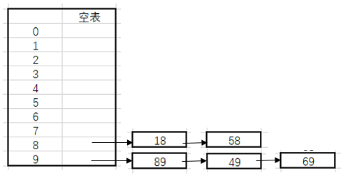
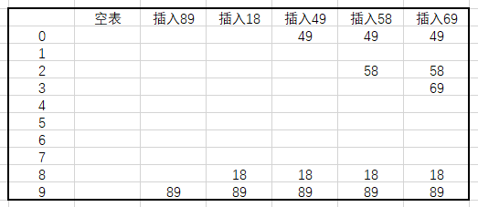
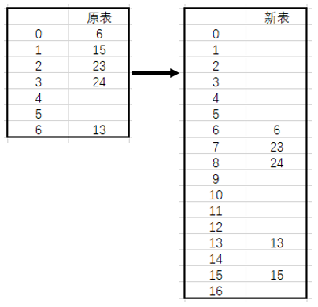

## 散列表
  
散列(hash)是一种用常数的时间插入删除和查找的技术。  

### hash冲突解决方法

***链接法***  
对于冲突的元素使用链表的方式管理，其缺点是使得访问的效率变低。  
  

***线性探测法***  
对于冲突的元素使用线性探测的方式寻找不冲突的位置，相应的其访问与删除操作都会受影响。  
访问时，原位置元素没找到还需往后探测，直到找到或者为空(没找到)为止。  
删除时，避免原位置直接删除会影响后续元素的访问，故有两种策略：  
第一种直接把删除的元素标记为delete属性，相当于延时删除。  
第二种把删除元素后面的元素移动到前面(该方法还需判断元素的hash位置等。。。)  
  

***二次探测法***  
该方法是对线性探测的改进，可以减少冲突几率，故其优缺点与线性探测类似  
  
  

### rehash
当满足扩容条件后(达到设定负载因子)，一般会把整个hash表扩容。  
常用的策略是取最小的大于两倍原表大小的质数，如原表为 7-->17  
***rehash:***  
 