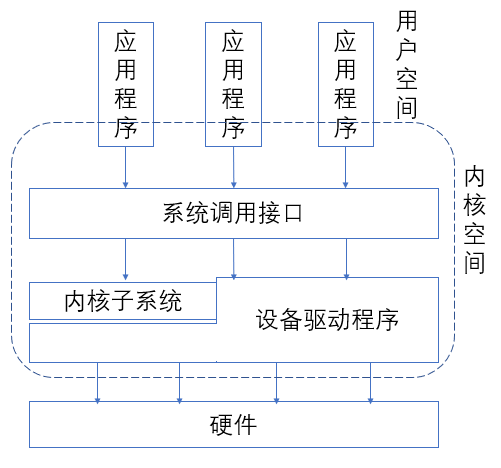

# Linux内核设计与实现  
本书为Linux内核代码入门的经典书籍，我看本书只是为了了解Linux的内核设计思想，为了更加了解linux系统，不深究具体的内核代码实现。  
  
  
## 目录
* [Linux内核简介](#Linux内核简介)
* [进程管理](#进程管理)
* [任务调度](#任务调度)
* [系统调用](#系统调用)
* [中断和下半部](#中断和下半部)
* [内核同步机制](#内核同步机制)
* [定时器和时间管理](#定时器和时间管理)
* [内存管理](#内存管理)
* [虚拟文件系统](#虚拟文件系统)
* [块IO](#块IO)
* [进程地址空间](#进程地址空间)


## Linux内核简介  
操作系统包括：内核、设备驱动程序、启动引导程序、命令行shell或者其他类型的界面、基本的文件管理工具和系统工具。  
内核为操作系统的核心、一般的内核包括：负责相应中断的中断服务程序、负责管理多个进程从而分享处理器时间的调度程序、负责管理进程地址空间的内存管理程序、网络、进程间通信等系统服务组成。  
应用程序、内核与硬件的关系如下图：  
  
实际上处理器必然处于以下三个状态之一：  
1、运行于用户空间，执行用户进程。  
2、运行于内核空间，处于进程上下文，代表某个进程执行。  
3、运行于内核空间，处于中断上下文，与任何进程无关，代表在处理中断。  
  
## 进程管理  
### 进程  
进程就是处于执行期间的程序，主要包括：可执行程序代码、执行的数据、以及执行期间的其他资源，比如：打开的文件、挂起的信号、内核的数据、处理器状态、一个内存地址空间、一个或多个线程。  
线程是进程中的活动对象，相当于一个逻辑执行单元，每个线程都有一个独立的程序计数器、进程栈和一组进程寄存器。  
### 进程描述符  
内核把进程的列表放到一个叫任务队列的双向循环链表中，链表中每一个结构体为task_struct，称为进程描述符，进程描述符包括一个进程的所有信息，大小约有1.7K。  
在X86系统中，由于寄存器较少，只能通过间接访问的方式，访问进程表述符，一般在栈顶创建一个结构struct thread_info，该结构体中存放有一个指向自身task_struct的指针，一个进程内核栈的示意图如下：  
  

### 进程创建  
***写拷贝技术***  
传统的fork()系统调用，会直接把所有资源复制给新创建的进程，这种方式效率很低下。写拷贝技术是指在需要写入操作时，数据才会被复制，进程才有属于自己的拷贝，而读操作的数据是共享的，这样fork()的实际开销就是复制父进程的页表及创建文件描述符。  
***fork()系统调用***  
实际调用的是do_fork()函数，do_fork()函数调用copy_process()，并让进程开始运行，copy_process()函数完成的主要工作如下：  
1、创建内核栈、thread_info结构体和task_struct结构体（该结构体实际是内存复用，系统开始运行即提前生成好，由特定函数来管理并分配给内核使用）。  
2、检查创建进程是否会超过资源限制，如超过进程数目上限。  
3、初始化结构体中的相关数据。
4、给新进程分配PID。  
5、根据传来的参数，copy打开的文件、文件系统信息、进程地址空间等。因为实际的线程创建函数也是调用的这个copy_process()系统调用，而线程中以上数据是共享的，因此不用copy一份，而创建进程则需要又copy一份。  
copy_process()函数完成其他工作并返回，do_fork()函数会唤醒子进程，让子进程优先执行，因为一般创建进程后会马上调用exec()函数。  
***vfork()系统调用***  
vfork不复制父进程的页表，其他与fork一样。子进程运行在父进程的地址空间并且不允许写操作，此时父进程被阻塞，直到子进程推出或者exec()，exec()系统调用在加载新进程时会复制进程空间。  
vfork()函数的目的是为了减少拷贝，并且保证子进程先运行，然而这个问题被写拷贝技术解决了。所以在正常情况下，不推荐使用vfork()函数。  
  
### 线程实现  
在linux中，内核不区分线程与进程，当创建线程时，内核任然会创建一个task_struct结构体，只是这些线程会与其他线程共享某些资源，如进程地址空间、文件系统资源、文件描述符等，即在创建线程时，以上资源不会被复制。  

### 进程终结  
进程终结基本上会调用do_exit()，主要完成以下工作：  
1、修改task_struct中的一些标志位，删除本进程的内核定时器。  
2、释放进程的共享内存，离开等待队列。  
3、释放文件描述符、文件资源。  
4、向父进程发信号，或者给子进程找养父。（如init进程）并把进程状态修改为EXIT_ZOMBIE态。 
5、do_exit()调用schedule()切换到其他进程，因为EXIT_ZOMBIE态进程不会被调度，故do_exit()不会返回。  
为什么会把进程设置为EXIT_ZOMBIE态，因为进程自己本身是不能回收完自己的所有资源的，如内核栈、task_struct结构体等等。因此需要通知其他进程来辅助exit的进程回收资源。  

***父进程回收子进程资源***  
wait()函数的作用是挂起父进程，等到子进程退出时，会唤醒父进程。  
最终释放进程描述符时，release_task()系统调用，用于回收文件描述符，主要完成以下工作：  
1、从pidhash上删除该进程，并从任务列表中，删除该进程。  
2、释放目前僵死进程的所有剩余资源。  
3、释放内核栈和thread_info结构所占的页，释放task_struct结构体的高速缓存。  
  
## 任务调度  

### 多任务
多任务分成非抢占式多任务和抢占式多任务，抢占式多任务模式是由调度程序来决定什么时候停止一个正在执行的进程，这个强制挂起的动作就叫抢占，每个进程运行的时间叫做时间片。相反，非抢占式多任务则是由进程自己停止运行，否则它会一直执行，这种挂起的动作叫做让步。  

### Linux的进程调度
Linux进程调度2.6之前采用一种叫做O(1)的调度算法，其主要特点是，静态时间片算法和针对每一个处理器的运行队列。  
LinuxO(1)调度算法，在多处理器环境中表现完美，但是对于调度事件响应敏感的进程有不足，即对于交互进程表现不足。  
在后续版本中，Linux提出一种叫做完全公平调度算法(CFS)，该算法解决了上述对交互程序不友好的问题。  

### 常见调度策略  
***I/O密集型进程与CPU密集型进程***  
I/O密集型进程指进程的多数时间用来提交I/O与等待I/O请求，比如GUI进程，会在多数时间等待鼠标或者键盘的输入，这种进程通常运行很短时间就会阻塞。  
CPU密集型进程则是把大多数时间用在执行代码上，如进行大量数学计算的进程MATLAB。从系统相应速度考虑，调度器应该尽量降低他们的调度频率，延长其运行时间。  
  
***进程优先级***  
Linux才用了两种优先级范围，一个是nice值，范围-20到+19，默认为0，nice值越大，优先级越低，高优先级的进程可以获得更多的处理器时间。  
第二种是实时优先级，实时优先级越高，则进程的优先级越高，所有的实时进程的优先级都高于普通进程。  

***时间片***  
时间片表示进程所能持续运行的时间，进程片的过长会导致系统对于实时系统的相应速度变现不好，让用户感觉延迟，进程片过短会增加进程切换的消耗，降低CPU性能。
这也是I/O密集型进程与CPU密集型进程的矛盾，I/O进程希望时间片短，系统相应迅速，CPU进程希望时间片长，这样可以提高CPU以及高速缓存的效率。  
Linux的CFS调度器是将CPU的使用比划分给进程，nice值越高的进程CPU使用比越低，nice值越低的进程CPU使用比越高。即nice值对应该进程享有的CPU权重，每一次分配时间片时，CFS算法会根据当前进程所占就绪进程的权重来分配时间片。  
Linux的抢占时机完全取决于新进程时间消耗的CPU使用比，如果新进程使用比比当前进程小，则新进程会立刻投入运行。  

***一个例子***  
一个系统同时运行两个进程，文本编辑器与视频解码进程，二者nice值一样，则表示两个进程CPU使用比都为50%。  
在实际运行过程中，因为文本编辑器经常等待用户输入，所以该进程经常挂起，其CPU使用比会低于50%，而视频解码进程使用比会高于50%。  
所以在视频解码进程运行时，此时用户输入，文本编辑进程被唤醒，CFS发现文本编辑器实际消耗的CPU使用比很少，本着所有进程公平分配处理器的原则，文本编辑器会抢占视频解码进程，立刻投入运行。  
  
### Linux的调度算法  
1、调度器类：Linux调度器以模块方式提供，这样使得不同进程可以针对性使用调度算法，CFS算法是针对普通进程的调度类。  
2、相对时间：nice值与时间片不是简单的绝对映射，而是体现一个权重，nice值表示进程即占一个调度周期的权重。(一个调度周期与实际环境有关)  
3、优先级：Linux使用CPU使用比的方式，体现一种进程的动态优先级。实际执行时间越长的进程，优先级越低。  
  
### Linux的调度实现  

***时间记账***  
CFS调度算法使用一个vruntime(虚拟运行时间)的变量来表示进程的执行时间，vruntime为进程执行时间的加权，即每一次进程执行完后，vruntime = vruntime + deltaT * NICE_0_LOAD/weight;(deltaT为实际执行时间)  
权重的含义表示，对实际执行时间的一个放大或缩小，即nice值越小，优先级更高，对应的权重也越大，如果nice<0，实际执行时间会被缩小，下次执行的可能性就更大。  
***进程选择***  
CFS使用一个rbtree来组织可运行进程，其键为vruntime的值，每一次CFS会选择当前rbtree中vruntime最小的进程。
***schedule()***  
调度进程的入口函数，会找到最高优先级的调度类，然后从这个调度类中找到最高优先级的进程，并投入运行。  

### 上下文切换与抢占  
***上下文切换***  
上下文切换主要会完成两项基本的工作：  
1、虚拟内存映射从旧进程切换到新进程。  
2、处理器状态旧进程切换到新进程，包括保存以及回复栈信息和寄存器信息。  
内核提供一个need_resched标志，用来表示需要重新执行一此进程调度，内核发现该标志，会执行schedule()。
***用户抢占***  
内核空间返回用户空间时，发现need_resched标志，会导致schedule()调用。即系统调用或者中断返回时，可能发生用户抢占。  
***内核抢占***  
当内核代码在执行时，只要重新调度是安全的，内核也会抢占正在执行的任务。  

### 实时调度策略  
Linux提供两种实时任务调度策略，FIFO和RR。  
这两种调度策略的优先级是高于普通调度进程优先级的，FIFO没有时间片的概念，进程会一直执行下去进程直到让出处理器，RR是一种带有静态时间片的FIFO。


## 系统调用  
系统调用是用户空间进程与硬件之间的一个中间层，作用主要有以下三点：  
1、为用户提供硬件接口的抽象。  
2、保证系统的安全与稳定，避免用户直接操作硬件设备。  
3、如果用户可以直接访问硬件，则用户进程之间会互相影响，没法实现多任务与虚拟内存机制。  
在Unix世界中，最流行的应用编程是基于POSIX标准，应用程序与C库与系统调用的关系如下：  
  
### 系统调用  
每一个系统调用有一个系统调用号，一但分配一个系统调用号以后不能有任何改变，对于无效的系统调用，系统会调用sys_ni_syscall()表示无效的系统调用。  
用户空间无法执行内核态代码，因此Linux通过软中断的方式实现用户空间陷入内核空间：通过引发一个异常使得系统切换到内核态去执行异常处理程序，该异常处理程序会根据实际系统调用号，执行系统调用处理程序。  
在x86上，系统调用号通过eax寄存器传递给内核，系统调用的参数通过edx、exc、edx、esi、edi寄存器传递，当需要六个或以上参数时，使用一个寄存器存放指向所有这些参数在用户空间地址的指针。  
  
### 系统调用的实现  
***参数验证***  
系统调用必须检查所有的参数是否有效，其中最重要的一项就是检查用户提供的指针是否有效。  
内核必须保证：  
1、指针指向的内存区域属于用户空间。  
2、指针指向的内存区域在进程的地址空间中。
3、读写操作的内存区域必须合法，即读操作必须为可读，写操作必须为可写。  
内核不接受轻易接受来自用户的指针，一般会对内核空间与用户空间的数据来回拷贝，为此，内核提供了copy_to_user()和copy_from_user()来实现指针的安全检查以及数据的来回拷贝。  
***系统调用上下文***  
在进程上下文中，内核可以休眠(如系统调用阻塞或者调用schedul())而且可以被抢占，因此新的进程可能会调用相同的系统调用，系统调用必须是可重入的。  
***系统调用绑定***  
编写完系统调用后，还需把它注册成为一个正式的系统调用。  
1、把系统调用加入系统调用表。  
2、在<asm/unistd.h>中新增系统调用号。  
3、系统调用编译进内核映像。  
***从用户空间访问系统调用***  
通常，用户通过连接C库，间接使用系统调用，Linux也支持通过宏直接访问系统调用。  

## 中断和下半部  
由于硬件与处理器的速度的差异，硬件响应速度过慢会影响操作系统的效率，内核可以在等待硬件期间处理其他事务，硬件完成操作后采用中断的方式通知处理器。  
### 中断处理程序  
在相应一个中断的时候，内核会执行相应的中断处理程序，并且中断处理程序是原子性的，不能被其他程序所打断。  
中断处理程序还应该足够快，能够完成一定的工作量，所以一般会把中断处理程序分成两部分，上半部与下半部，上半部做有时限的工作，主要包括对中断的应答，及一些简单的工作，在这一期间其他本处理器不会响应其他中断，剩下的工作被放到下半部执行。  
### 注册中断处理程序  
注册中断处理程序的系统调用为:  
```
int request_irq(unsigned int irq, irq_handler_t handler, unsigned long flags, const char* name, void *dev);
```
其中unsigned int irq 指中断号。  
irq_handler_t handler 实际的指中断处理程序。  
unsigned long flags 相关标记。  
const char* name 中断设备的名字。  
void *dev 中断设备的结构体，后续会作为参数传给irq_handler_t handler 。
### 中断上下文  
当执行一个中断处理程序时，内核处于中断上下文，中断上下文不可以睡眠，也不可被中断。并且处于中断上下文时，相应中断线在所有处理器上都会被屏蔽，防止接收到另一个中断。  
中断处理程序有自己的栈，每个处理器一个，大小为一页，称之为中断栈。  

### 下半部  
如果中断处理时间过长，会影响其他任务的执行速度，中断处理分成中断处理程序与下半部是为了提高系统的相应速度，将部分任务延后。  
中断处理程序与下半部的工作并没有明确的界定，一般按如下方法分：  
1、任务对时间非常敏感，放在中断处理程序。  
2、任务与硬件有关，如硬件数据拷贝，放在中断处理程序。  
3、任务不能被打断，放在中断处理程序。  
4、其他任务考虑放在下半部。  

### 软中断  
***软中断的实现***  
软中断在linux中实现流程整体如下：  
  
其中软中断处理程序被放在一个大小为32的静态数组中，soft_action为一个函数指针，如下： 
``` 
static struct soft_action softirq_vec[NR_SOFTIRQS];
```
软中断可能在以下情况下执行：  
1、从硬中断返回处，即在中断处理程序执行完后。  
2、在内核线程ksoftirqd中，该线程为软中断守护进程，在处理器空闲时处理软中断。  
3、显示检查和执行软中断的代码。上述两种方式都是在软中断位图置位时，由处理器检查并执行软中断处理程序。  

Linux的软中断目前使用了9个，其中两个用来实现tasklet，两个用来实现网络数据包的收发，还有一个是定时器的下半部，建议用户不适用软中断，而是使用tasklet实现软中断任务。  

### tasklet
软中断在被处理时，同一个软中断可能被另一个处理器触发，这就意味着共享数据，需要加锁来保护数据，防止并发，这样软中断就没有意义了。  
为了解决上述问题，Linux提出了tasklet的概念，tasklet可认为是对软中断的封装，使得一个处理器处理只处理一个tasklet，这样就可以避免数据共享，还不影响中断的执行效率。  
***tasklet的实现***  
tasklet是通过软中断实现的，即由两个软中断号即为tasklet的处理，并且使用tasklet状态标记来防止CPU之间的并发，大概实现过程如下。  
***tasklet_schedule()***  
调度tasklet的函数，即把taskley设置为就绪，等待CPU处理，主要工作如下：  
1、检查当前tasklet状态是否为就绪态，如果为就绪态说明该tasklet已经被调度了，不可重复调度。  
2、禁用本地中断，因为要处理本处理器上的数据，所以不能被硬中断所打断。(如果开启中断，则有可能导致当前处理器再次重入这个tasklet，导致数据混乱)  
3、把需要调度的tasklet加入当前处理器的tasklet链表。
4、唤醒软中断，即raise_softirq_irqoff(TASKLET_SOFTIRQ);
5、恢复本地中断。
***tasklet_action()***  
tasklet的软中断处理函数，由do_softirq()调度，主要工作如下：
1、禁用中断。
2、清空当前CPU的tasklet链表，即转换为局部，使得其他硬中断产生的其他tasklet任然可以响应。  
3、允许中断，因为当前处于软中断处理期间，软中断可以被硬中断所打断。  
4、循环处理就绪的tasklet。  
5、检查待处理的tasklet状态是否为run，如果为run，说明其他处理器正在处理这个tasklet(可能由于硬中断，再次触发这个tasklet)，把这个tasklet重新挂到CPU链表尾部。  
6、如果不是run处理tasklet，直到处理完。  
***ksoftirqd***  
软中断守护进程，本进程的nice值为19，优先级很低，不会与用户进程抢执行时间，当CPU空闲时，会处理本CPU上的软中断。
当存在大量软中断重复触发时，因为软中断优先级比较高，会导致用户进程饿死的情况。  
因此使用一个低优先级的守护进程专门执行软中断，这样当CPU繁忙时，因为优先级比较低，大量的软中断不会与用户进程抢占CPU资源，而即时的软中断被硬中断的中断处理函数即时处理。  
### 工作队列
因为软中断与rasklet不允许被打断，所以tasklet不能睡眠，而部分下半部工作需要睡眠，因此Linux还有工作队列的方式来实现下半部。  
工作队列的工作交由一个内核线程去完成，因此，这些工作会在进程上下文中执行，并且能够被进程调度来管理。  

***工作队列的实现***  
workqueue_struct，表示一个工作队列，该结构体数据结构如下：  
```
struct workqueue_struct {
 struct cpu_workqueue_struct cpu_wq[NR_CPUS];
 struct list_head list;//工作队列结构本身是一个队列
 const char *name;   //workqueue name
 int singlethread;   //是不是单线程 - 单线程我们首选第一个CPU -0表示采用默认的工作者线程event
 int freezeable;  
 int rt;
};
```
cpu_workqueue_struct表示一个CPU，该结构体数据结构如下：  
```
struct cpu_workqueue_struct {
 spinlock_t lock; 
 struct list_head worklist;	//工作列表
 wait_queue_head_t more_work;
 struct work_struct *current_work; //当前的work
 struct workqueue_struct *wq;   //所属的workqueue
 struct task_struct *thread; //线程
}
```
结构体work_struct表示任务，定义如下:  
```
struct work_struct {
    atomic_long_t data;       //工作处理函数func的参数
    struct list_head entry;        //Linux的链表
    work_func_t func;              //工作处理函数

};
```
以上三者的关系图如下：  
  
每个CPU的工作线程在调用时会不断判断当前work_list是否为空，为空则让出CPU，不为空则执行工作。  

### 下半部机制的选择
上述三种机制的对比：  
1、tasklet基于软中断实现，因此两个很接近，只是tasklet不能并行，而工作队列采用内核线程实现。  
2、tasklet与软中断不可睡眠，而工作队列可以。  
3、tasklet与软中断没有上下文切换，执行开销相比工作队列小。  
4、tasklet可以保证在同一个处理器上串行执行，减少了数据独享的问题。  
因此，对于下半部任务来说，需要休眠的，只能采用工作队列来实现，而考虑效率的情况使用tasklet，避免使用软中断。  

## 内核同步机制  
当并发访问共享数据时，必须保证数据的正确性，因此需要一定的同步机制。由于Linux内核支持对称多处理器，因此对于共享数据需要提供一定的同步机制的支持。  
### 内核并发的问题  
***内核并发的情况***  
内核存在以下并发的情况：  
1、中断，中断可能打断正在执行的代码。  
2、软中断与tasklet，与中断类似，内核可能在任意时刻打断正在执行的代码，调度软中断与tasklet。  
3、内核抢占，内核中的任务可能被另一个任务抢占。  
4、睡眠与用户空间同步，进程可能睡眠，导致调度器执行另一个新用户进程。  
5、对称多处理器，多个处理器可能同时执行一段代码。  
***编写内核程序的问题***  
需要理解同步机制需要保护的数据，而不是代码，因此，在编写内核程序时，要考虑以下问题：  
1、这个数据是否为全局数据，除了当前线程是否其他线程可访问。  
2、该数据是否在进程上下文或者中断上下文中共享，是否在两个不同的中断处理程序中共享。  
3、进程在访问数据时是否可能被抢占，新调度的程序会不会访问同一资源。  
4、当前进程会不会阻塞在某一资源上。  
5、这段代码同时在另一处理器上调度，会怎样。  
***死锁***  
一些避险死锁的规则：  
1、按顺序加锁，使用嵌套锁时，按照相同的顺序获取锁。  
2、不要重复请求同一个锁，即锁不重入(不适用递归锁)  
3、设计简单，越复杂的设计越可能死锁。  

### 原子操作  
Linux提供了两组原子操作的接口：对整数操作和对位操作的原子操作。  
***整数原子操作***  
针对整数的原子操作，Linux定义了一个特殊的数据类型，定义如下：  
```
typedf struct{
	volatile int counter;
} atomic_t
```
使用自定义类型的好处有：  
1、让原子操作函数只接受上述类型，保证原子操作函数与特有的数据结构关联。  
2、同时保证原子操作的类型不会传递给非原子操作函数。  
原子操作通常是内联函数，通过内嵌汇编代码来实现：  
```
static __inline__ void atomic_add(int i, atomic_t *v)
{
        __asm__ __volatile__(
                LOCK_PREFIX "addl %1,%0"
                :"+m" (v->counter)
                :"ir" (i));
}
//其中LOCK_PREFIX的定义如下:
#define LOCK_PREFIX /
                ".section .smp_locks,/"a/"/n"   /
                "  .align 4/n"                  /
                "  .long 661f/n" /* address */  /
                ".previous/n"                   /
                "661:/n/tlock; "
//大概意思是，使用lock指令吧atomic_add中的代码锁住，使得处理器独占内存。
```
***原子性与顺序性***  
原子性是保证一条指令在执行期间不能被打断。  
顺序性是保证多条指令出现在独立的执行线程，甚至独立的处理器上，其执行顺序不会被打乱。  
***位原子操作***  
Linux还提供了对单独的位操作的原子操作。  

### 自旋锁  
自旋锁只能被一个线程持有，其他线程在尝试获得自旋锁的过程中会一直循环等待自旋锁锁可用，这一过程是消耗CPU的，因此，持有自旋锁的时间最好小于完成两次上下文切换的时间，即持有自旋锁尽量短。  
在x86中自旋锁 首先关闭内核抢占，关闭本地中断，然后执行raw_spin_lock()。raw_spin_lock()的代码实现如下： 
```
static inline void __raw_spin_lock(raw_spinlock_t *lock)
        {
            asm volatile(
            "\n1:\t"
            LOCK_PREFIX " ; decl %0\n\t"
            "jns 2f\n"
            "3:\n"
            "rep;nop\n\t"
            "cmpl $0,%0\n\t"
            "jle 3b\n\t"
            "jmp 1b\n"
            "2:\t" : "=m" (lock->slock) : : "memory");
        }
		//lock->slock在没加锁时，初始状态为1
		//LOCK_PREFIX表示执行这条指令时将总线锁住,使得lock->slock自减为原子操作
		//jns表示，上一行结果>=0则跳转，即lock->slock自减后，结果>=0则跳转2。2处什么都没有，则能够往下执行，表示加锁成功
		//<0则表示加锁失败，因为有其他线程已经持有自旋锁了
		//3处，代码表示将lock->slock与0进行比较，如果小于零则再次跳到3处执行。直到加锁者释放锁将lock->slock设为1，此时会跳到标号1处进行加锁操作。
```
解锁操作，先恢复内核抢占，恢复本地中断，执行raw_spin_unlock();  
```
static inline void __raw_spin_unlock(raw_spinlock_t *lock)
        {
            asm volatile("movl $1,%0" :"=m" (lock->slock) :: "memory");
        }
		//解锁只是简单的原子操作，lock->slock = 1;
```
由上面可以看出，自旋锁会禁用中断与内核抢占，因此，自旋锁要尽快解锁。  


### 信号量  
信号量是一种睡眠锁，当一个任务试图获取信号量，但获取不到时，信号量会把这个进程推入一个等待队列，让其睡眠。  
由于信号量会使得进程睡眠，因此有以下特性：  
1、信号量适合锁被长时间持有的情况。  
2、由于竞争信号量会导致睡眠，所以只能在进程上下文中使用信号量，中断上下文不能调度使用信号量。  
3、占有信号量时不能占用自旋锁，因为自旋锁不允许睡眠。  
信号量的内核实现代码如下：
```
//信号量的数据结构
struct semaphore {
        atomic_t count;	//信号量数值
        int sleepers;	//表示是否有一些进程在信号量上睡眠。有进程睡眠为1
        wait_queue_head_t wait;	//等待进程链表
    };
```
信号量up()函数如下，up()函数会把信号量增加，表示释放信号量  
```
static inline void up(struct semaphore * sem)
    {
        __asm__ __volatile__(
            "# atomic up operation\n\t"
            LOCK "incl %0\n\t"     // ++sem->count
            "jle 2f\n"	//测试count值，如果当前小于等于0，那么有进程在等待，跳到2f，唤醒等待进程。
            "1:\n"		//count>0表示，解锁完成，直接返回
            LOCK_SECTION_START("")
            "2:\tlea %0,%%eax\n\t"	//count<=0，表示有进程等待，唤醒等待线程。  
            "call __up_wakeup\n\t"
            "jmp 1b\n"
            LOCK_SECTION_END
            ".subsection 0\n"
            :"=m" (sem->count)
            :
            :"memory","ax");
    }

    fastcall void __up(struct semaphore *sem)
    {
        wake_up(&sem->wait);//唤醒等待线程
    }
```
信号量down()函数如下，down()函数会把信号量减少，表示尝试获取信号量  
```
static inline void down(struct semaphore * sem)
    {
        might_sleep();
        __asm__ __volatile__(
            "# atomic down operation\n\t"
            LOCK "decl %0\n\t"     // --sem->count
            "js 2f\n"
            "1:\n"
            LOCK_SECTION_START("")
            "2:\tlea %0,%%eax\n\t"	//count<0，说明有线程把持这个信号量，则调用__down()睡眠
            "call __down_failed\n\t"
            "jmp 1b\n"
            LOCK_SECTION_END
            :"=m" (sem->count)
            :
            :"memory","ax");
    }
	
fastcall void __sched __down(struct semaphore * sem)//相当于睡眠函数
    {
        struct task_struct *tsk = current;//当前进程

        DECLARE_WAITQUEUE(wait, tsk);
        unsigned long flags;
        tsk->state = TASK_UNINTERRUPTIBLE;

        spin_lock_irqsave(&sem->wait.lock, flags);	//在将进程放到等待队列前，先获得锁，并禁止本地中断。
        add_wait_queue_exclusive_locked(&sem->wait, &wait);//将进程链入等待队列中

        sem->sleepers++;
        for (;;) {
            int sleepers = sem->sleepers;

            if (!atomic_add_negative(sleepers - 1, &sem->count)) {	//尝试给count + sleepers - 1，如果>=0，说明拿到了信号量
                sem->sleepers = 0;
                break;
            }
            sem->sleepers = 1;  
            spin_unlock_irqrestore(&sem->wait.lock, flags);//恢复本地中断
            schedule();//让出处理器

            spin_lock_irqsave(&sem->wait.lock, flags);	//因为要尝试修改sem->count，该过程不可被打断，禁用本地中断
            tsk->state = TASK_UNINTERRUPTIBLE;
        }

        remove_wait_queue_locked(&sem->wait, &wait);	//因为要执行了，将进程从等待队列中移除

        wake_up_locked(&sem->wait);	//再次尝试唤醒等待线程，因为之前可能唤醒的不止一个线程
        spin_unlock_irqrestore(&sem->wait.lock, flags);	//恢复本地中断
        tsk->state = TASK_RUNNING;
    }
```
### 互斥量  
互斥量可认为初始值为1的信号量，即只能有一个线程进入互斥量保护的代码。互斥量有如下特点：  
1、任何时刻只有一个任务可以持有mutex  
2、给mutex上锁者必须再给它负责给它解锁  
3、不允许递归上锁。  
4、持有mutex的进程不允许推出。  
5、mutex不能在中断与下半部中使用，因为mutex会导致睡眠。  
6、与信号量相比，建议优先使用互斥量，除非互斥量不能满足需求。  

### 禁止抢占  
内核提供禁止抢占的操作。  

### 顺序与屏障  
在多处理器上，编译器和处理器为了效率。可能会对读写内存的顺序重排，内核同样提供操作，使得处理器按照一定的顺序执行读写操作。  


## 定时器和时间管理  
内核中，需要延后一段时间执行一些任务，管理着实际日期与时间，需要周期性执行某些任务，因此内核时间的管理很重要。  
常见的利用时间中断执行的周期性任务有：  
1、更新系统运行时间、更新实际时间。  
2、处理器负载均衡。  
3、检查当前进程时间片是否用尽。  
4、运行定时器。  
5、更新系统资源的统计值。

### 节拍率HZ与时钟  
系统节拍率是静态定义的，表示系统处理器每秒钟时钟中断多少次。x86体系结构的定义一般为1000，即整个系统的精度为1ms。  
***高HZ的优势***  
1、内核定时器精度更高，使得依赖定时执行的进程运行更准确。(如poll，epoll)  
2、对于资源消耗时间和系统运行时间等测量更准确。  
3、提高进程的抢占精度。  
***高HZ的劣势***  
1、系统负担更大，处理器会花费更多时间来处理时钟中断。  

***jiffies***  
一个全局变量用来记录自系统启动以来产生的节拍数量。  

***实时时钟***  
是一个用来持久放系统时间的设备，由微电池供能，在系统启动时，用来初始化xtime变量。  

***实际时间***  
在内核中用xtime保存，周期性的由实时时钟更新，其精度由HZ决定，为1ms。  

### 时钟中断处理程序  
时钟中断处理程序一般会执行如下工作：  
1、获得xtime锁  
2、重设系统时钟，周期性更新墙上时间，也就是实时时钟的数据  
3、给jiffies加一，包括溢出维护机制等
4、更新系统消耗资源统计值，如当前进程消耗的时间等
5、执行已经到了的定时器
6、更新xtime

### 定时器  
定时器作为软中断在下半部上下文中执行，内核会判断定时器是否超时，进而执行相应的任务。  


## 内存管理  
在内核中，内核本身不能像用户空间那样奢侈的使用内存，因此内核的内存机制更复杂。  
### 页  
内核以物理页作为内存管理的基本单位，MMU也以页大小为单位来管理系统中的页表。  
内核中使用struct page来表示系统中的物理页，并且每个物理页都分配一个这样的结构体，其定义如下：  
```
struct page{
	unsigned long			flags;		//表示页状态，比如脏页，是否被锁定在内存中等等
	atomic_t 				_count;		//页被引用次数，当计数变为-1，表明内核没引用这一项。
	atomic_t				_mapcount;	//被进程共享的次数，为-1，表明没有进程使用这一项
	unsigned long			private;
	struct address_space	*mapping;
	pgoff_t					index;
	struct list_head		lru;
	void 					*virtual;	//虚拟内存地址，当该页没有映射时，为NULL
}
```
### 区  
由于硬件的限制，内核对待所有的物理页并不一样，Linux把页划分为不同的区，一般分四个区：  
ZONE_DMA：该区的页可用来执行DMA(直接访问内存，是操作系统为了加速，提供的一种机制，即设备可直接访问内存，不必通过CPU的存储)  
ZONE_DMA32：与ZONE_DMA作用一样，只是这些页面专门针对32位设备。  
ZONE_NORMAL：该区的页都能够正常映射。  
ZONE_HIGHEM：高端内存，其中的页不能被永久映射到内核空间，该区是为了兼容某些设备。  

### 获取页  
Linux提供相应函数用来获取页或者释放页。  
```
struct page* alloc_pages(gfp_t gfp_mask, unsigned int order);
//分配 2^order 个连续的物理页，并返回第一个struct page的指针

unsigned long __get_free_pages(gfp_t gfp_mask, unsigned int order);
//分配 2^order 个连续的物理页，并返回第一个struct page的逻辑地址

unsigned long get_zeroed_pages(gfp_t gfp_mask);
//获取一个被0填充的页的地址

void __free_pages(sturct page* page, unsigned int order);
//释放页
```
### kmalloc()与vmalloc()
kmalloc()函数为分配一定大小内存块，返回指向该内存块的指针，定义如下：  
```
void* kmalloc(size_t size, gfp_t flags);
//size表示内存块的大小， flags表示控制标志
```
其中标志主要包括行为修饰符与区修饰符，行为修饰符会控制在该分配函数的睡眠，使用I/O等等行为，区修饰符指定从哪些区分配内存。  
vmalloc()一样用来分配内存，只是kmalloc()会保证物理内存连续，而vmalloc()只能保证虚拟内存连续。  
### slab
内核中会经常分配与回收数据结构，Linux为了提高分配效率，提供slab机制(相当于对象池)  
slab层是把不同的对象划分为高速缓存组，即一个高速缓存能够存放一种类型的对象。而一个高速缓存又包括三个slab链表，一个slab一般为几个连续的物理页，每次就从中取出一个生产的数据结构。  
### 分配函数的选择
以下准则：  
需要连续的物理页，使用页分配器或者kmalloc  
需要虚拟地址连续的页，使用vmalloc  
需要创建与撤销大量的数据结构，使用slab  

## 虚拟文件系统
VFS作为内核子系统，对外，向用户提供文件与文件系统的标准接口，对内，隐藏不同文件系统与不同介质文件的访问细节。 
文件系统是在磁盘上组织与管理文件的系统，即为用户提供文件的建立、存入、读取、修改、删除等服务，常见的文件系统有，windows的NTFS，Linux的Ext3，Ext4。  
### 文件系统抽象
VFS对外提供类似于open(),read(),write()等系统调用，并且无需考虑具体的文件系统以及实际物理介质。因为内核在底层文件系统之上建立了一个抽象层。  
  
VFS提供了一个通用的文件系统模型，该模型为unix风格，包括了常见的文件系统的行为。(即抽象接口)  
### VFS对象及数据结构
***unix文件系统***  
unix文件系统提出了四个概念：文件、目录项、索引节点、安装点。  
unix安装点的概念是指，文件系统被安装在一个特点的安装点，并且所有的文件系统作为根文件系统的树叶，所有的文件系统在一个空间中。  
windows与Dos系统的做法，是把不同的文件系统划分命名空间。  
***VFS对象及数据结构***  
VFS采用面向对象设计，VFS的结构体包含数据的同时也包含操作这些数据的函数指针，其中主要的四种数据：
超级块对象：代表一个具体的已安装的文件系统。在文件系统安装时，文件系统会从磁盘中读取信息，用来填充超级块对象。  
索引节点对象：inode，代表一个具体的文件。索引节点包含了操作文件或者目录时的信息(如文件存储信息)，一般从磁盘索引节点读取。inode不仅可以表示文件信息还可以与管道、设备等相关。  
目录项对象：虽然目录都是inode，属于文件，但是为了方便查找，VFS引入了目录项的概念，即目录项用来描述文件之间的关系，用来加速查找操作。并且目录项只存在于内存中，由VFS根据路径名来创建，目录项为了加速查找还有缓存机制，存储最近访问的目录项对应的inode。  
文件对象：file，代表一个文件被一个进程所打开，file与inode唯一关联，与文件项一样，file只是存在在内存中。
### 其他数据结构
file_system_type,用来描述不同的文件系统类型。  
vfsmount,描述一个文件系统的实例。  
files_struct,描述一个进程所打开的文件信息。  
fs_struct,描述当前工作目录与根目录信息。  
namespace,命名空间。  

## 块IO
### 块与扇区
系统中能够随机访问固定大小数据片的硬件设备叫做块设备，如硬盘、软盘。按照字符流的方式顺序访问的设备叫做字符设备，如串口、键盘。  
扇区是块设备的基本单元，即扇区是设备的最小可寻址单元。而块则是文件系统的抽象，是软件的最小逻辑可寻址单元，块必须为扇区的整数倍，并且不能超过一个页。  
### 缓冲区与bio
缓冲区是块在内存中的表示，每一个块被载入内存，对应一个缓冲区，用buffer_head表示。  
缓冲区的缺点：1、每个块对应一个缓冲区，buffer_head的结构太大，浪费空间。2、缓冲区头只能描述一个块，对于较大数据的处理效率低。  
***bio结构体***  
bio结构体使用数组将片段组织在一起，并记录每一个片段的在物理内存中的页号，地址偏移、长度。即一个片段在物理内存中是连续的，一个bio结构体可以在内存中多个页面。  
### IO调度
块设备把他们的请求保存在请求队列中，IO调度程序把磁盘IO资源分配给系统所有的IO请求，即使得全局的IO操作更高效。
***IO调度程序的工作***  
1、请求合并，将相邻扇区多次请求压缩成一次请求。  
2、排序，把整个请求队列按照扇区增长的方向有序排列，减少磁头移动。  
***最终期限IO调度***  
该调度方法维护三个队列，读请求FIFO队列、写请求FIFO队列、排序队列。  
其中排序队列中，请求以磁盘扇区排序，以减少磁头移动，FIFO队列按照时间排序，当请求超过超时时间时(写请求5s，读请求500ms)，调度程序会调度FIFO队列中的请求，防止产生饥饿。  
***预测IO调度***  
预测IO调度与最终期限IO调度一样，同样维护三个队列，但是预测IO调度在处理完一个请求后，不会立刻返回，而是会等待几ms，当此时有磁头附近的扇区IO时，会立刻处理。  
对于读写操作具有局部性特点，这种等待几ms的方式会减少寻址时间，缩短系统响应时间，提高系统吞吐量。  

## 进程地址空间 
### 地址空间
进程地址空间由进程可寻址的虚拟内存组成，即进程并不是能够访问所有虚拟地址空间，进程只能访问合法的地址空间，当进程尝试访问非法地址的或者非法操作，会发生段错误。  
内存区域的各种内存对象：  
1、代码段，即可执行文件的内存映像。  
2、数据段，已初始化全局变量或静态变量的内存映像。  
3、BSS段，未初始化的全局变量(自动初始化为0)的全局映像。  
4、用户栈空间。  
5、C库、动态链接库等。  
### 内存描述符  
内核使用struct mm_struct(内存描述符)来表述进程的地址空间，包括了进程地址空间的全部信息。  
其中主要包括：  
内存链表、内存红黑树(这两个保存的都是vm_area_struct，只是采用不同组织方式)  
内存缓存链表(用来保存最近访问过的内存块)  
用户数量、引用计数(用来表述线程数量、用来锁整个数据结构)  
各个对象在内存中的地址(代码段、数据段、堆、栈)  
### 虚拟内存区域VMA  
vm_area_struct，描述了地址空间内连续一段空间，每个结构都对应进程地址空间中的唯一区域。  
而每个mm_struct用链表或者红黑树的方式组织VMA。  
***find_vma(),find_vma_prev(),find_vma_intersection()***  
以上三个函数都是根据进程地址，查找所属的VMA
***mmap(),do_mmap()***  
将一段内存加入到进程地址空间中，即把某一段虚拟内存加入到mm_struct中，可能是创建新的vma也可能是把旧的vma扩展。  

## 页高速缓存和页写回
页高速缓存(cache)是Linux实现的磁盘缓存机制，把磁盘中的数据缓存到物理内存中，减少磁盘IO。  
### 缓存机制 
***写缓存***  
Linux采用回写技术，程序执行写操作，会对缓存中的数据写，并把该页标记为脏页，由回写进程把脏页写回磁盘中。  
***缓存回收***  
1、LRU：使用LRU方式管理与回收缓存页。  
2、LRU/2：使用两个链表管理缓存，一个作为活跃链表，一个作为非活跃链表(维护两个链表数据量大致相等)，回收非活跃链表中的内容。  
### Linux页高速缓存
 


